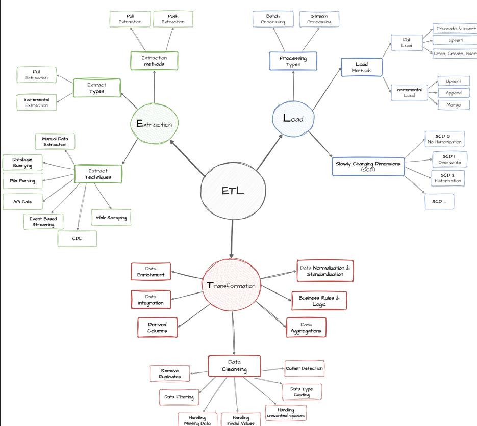

# SQL Data Warehouse Project

## 📌 Project Overview
This project demonstrates an **end-to-end SQL-based Data Warehouse**
designed using the **Bronze, Silver, and Gold layer architecture**.

The objective of this project is to ingest raw data from multiple sources,
clean and standardize it, apply business logic, and finally make it
**analytics-ready for reporting and decision-making**.

This project follows **industry best practices** used in modern data
engineering and analytics systems.

---

## 🏗️ Data Warehouse Architecture

The architecture is divided into three layers:

- **Bronze Layer** – Raw data ingestion
- **Silver Layer** – Data cleansing and transformation
- **Gold Layer** – Business-ready aggregated data

---

## 🔄 ETL Flow

The ETL process follows a **batch processing approach**:
- Extract data from source systems (CRM, ERP)
- Load raw data into Bronze layer
- Transform and clean data in Silver layer
- Aggregate and apply business logic in Gold layer

---

## 📂 Data Flow

This diagram shows how data moves from **source systems**
to the **data warehouse layers** and finally to **analytics tools**.

---

## 🧱 Data Warehouse Layers

### 🥉 Bronze Layer (Raw Data)
- Stores data **as-is** from source systems
- No transformations applied
- Used for traceability and auditing

**Load Type:**
- Full Load
- Truncate & Insert

**Objects:**
- Tables

---

### 🥈 Silver Layer (Cleaned Data)
- Data cleansing and standardization
- Handling missing values
- Data normalization
- Derived columns
- Business-friendly formats

**Transformations Include:**
- Data cleansing
- Standardization
- Enrichment
- Business rule application

**Objects:**
- Tables

---

### 🥇 Gold Layer (Business-Ready Data)
- Aggregated and optimized data
- Designed for analytics and reporting
- Supports BI tools and ad-hoc queries

**Transformations Include:**
- Aggregations
- Business logic
- KPI calculations

**Objects:**
- Views
- Aggregated tables
- Star schema / flat tables

---

## ✅ Data Quality Checks
Data quality checks are implemented to ensure **accuracy and reliability**.

Checks include:
- Null value checks
- Duplicate records
- Referential integrity
- Business rule validation

SQL scripts for data quality checks are available in the `/tests` folder.

---

## 📊 Data Consumption
The Gold layer data is consumed by:
- **Power BI dashboards**
- **Ad-hoc SQL queries**
- **Business reports**

This enables stakeholders to make **data-driven decisions**.

---

## 🛠️ Tools & Technologies Used
- SQL
- Data Warehousing Concepts
- Git & GitHub
- Power BI
- ETL Design Principles

---

## 📁 Repository Structure
sql-data-warehouse-project/
│
├── datasets/ # Source datasets
├── scripts/
│ ├── bronze/ # Bronze layer SQL scripts
│ ├── silver/ # Silver layer SQL scripts
│ └── gold/ # Gold layer SQL scripts
│
├── tests/ # Data quality check scripts
├── docs/ # Architecture, ETL, and documentation
├── README.md
└── LICENSE

---

## 🎯 Key Learnings
- End-to-end data warehouse design
- Layered architecture (Bronze, Silver, Gold)
- Writing optimized SQL transformations
- Implementing data quality checks
- Preparing data for BI and analytics

---

## 🚀 Future Enhancements
- Incremental loading
- Scheduling using orchestration tools
- Advanced data validation
- Performance optimization

---

## 👤 Author
**Chandrashekhar Patil**  
Third Year Computer Science Student  
Aspiring Data Analyst / Data Engineer  

🔗 GitHub: https://github.com/chandupatil07  
🔗 LinkedIn: https://www.linkedin.com/in/chandupatil07/
